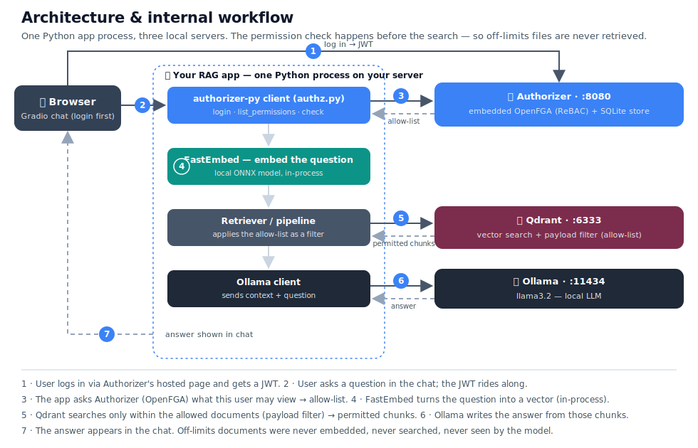

# Local RAG Knowledge Base Demo With FGA

A **fully local Retrieval-Augmented Generation (RAG) demo**: load plain-text documents, ask questions in a web UI, and get answers grounded in those files with cited sources. Embeddings (FastEmbed), vector search (Qdrant), and text generation (Ollama) all run on your machine — no cloud APIs in the pipeline.

> Stack: **Qdrant** · **FastEmbed** · **Ollama** · **Gradio** · **Authorizer + OpenFGA** · Python 3.11+

---

## What it does

1. **Ingest** — Splits `.txt` files into paragraph-aware chunks, embeds them, and stores vectors in Qdrant with deterministic IDs (idempotent re-ingestion, zero duplicates).
2. **Retrieve** — Finds the most relevant chunks for each question via cosine similarity, filtered by a keyword-indexed `source` payload field.
3. **Generate** — Sends context + question to a local Ollama model and returns an answer plus source snippets.
4. **Enforce** *(optional)* — With `--authorizer`, each user only retrieves documents they're permitted to view, enforced during the Qdrant search via OpenFGA.

Sample documents live in `data/knowledge_base/` (financial report, tech stack, onboarding guide, security policy). Replace or extend them with your own `.txt` files.

---

## Prerequisites

| Requirement | Notes |
|-------------|-------|
| **Python 3.11+** | [python.org](https://www.python.org/downloads/) |
| **Docker** | [docker.com](https://www.docker.com/) — runs Qdrant (+ dashboard) and Authorizer |
| **Ollama** | [ollama.com/download](https://ollama.com/download) — local LLM server |
| **~2–4 GB disk** | For one Ollama model; first run downloads ~25 MB embedding weights |

Ollama is **not** installed via `pip`. Install it separately, then pull at least one model.

---

## Getting started

Run all commands from the **project root** (`rag-local-demo/`).

### 1. Clone and install

```bash
git clone <your-repo-url>
cd rag-local-demo

python3 -m venv .venv
source .venv/bin/activate      # Windows: .venv\Scripts\activate
pip install --upgrade pip
pip install -r requirements.txt
```

### 2. Start Qdrant

```bash
docker compose up -d
```

Qdrant runs on `http://localhost:6333`. The built-in dashboard is at **http://localhost:6333/dashboard** — browse collections and visualise embeddings there.

### 3. Install Ollama and pull a model

```bash
# macOS / Linux
curl -fsSL https://ollama.com/install.sh | sh

ollama pull llama3.2      # default (~2 GB), or: mistral / phi3 / llama3.1
```

### 4. Ingest documents

Documents are ingested **once** before starting the app, not on every startup.

**Basic mode (no FGA):**

```bash
python scripts/ingest.py --storage http://localhost:6333
```

**Permission-aware mode — seeds users, grants, and docs in one shot:**

```bash
python scripts/fga_seed.py --storage http://localhost:6333
```

`fga_seed.py` is fully idempotent: re-running skips existing users, model, and tuples; deterministic chunk IDs mean re-ingestion updates rather than duplicates.

### 5. Run the web UI

**Basic mode:**

```bash
python src/app.py --storage http://localhost:6333
```

**Permission-aware mode:**

```bash
python src/app.py --authorizer http://localhost:8080 --storage http://localhost:6333
```

Browser opens at **http://localhost:7860**.

---

## Architecture

One Python process talks to three local servers. In permission-aware mode (`--authorizer`), the allow-list check happens **before** the vector search so forbidden documents are never retrieved or scored.



> Without `--authorizer`, steps 1–3 are skipped: plain local RAG (FastEmbed → Qdrant → Ollama) with no login.

---

## Fine-grained permissions (FGA)

Each user only retrieves — and therefore only gets answers from — documents they're allowed to see. Enforcement is inside the Qdrant search (a `MatchAny` payload filter built from the user's OpenFGA grants), so restricted chunks are never scored and top-k stays meaningful.

> Powered by [Authorizer](https://github.com/authorizerdev/authorizer) (self-hosted auth + embedded [OpenFGA](https://openfga.dev)). Requires Authorizer ≥ v2.3.0 — `docker-compose.yml` pins the version.

### Quick start

```bash
docker compose up -d
python scripts/fga_seed.py --storage http://localhost:6333
python scripts/fga_demo.py --storage http://localhost:6333        # CLI walk-through
python scripts/fga_demo.py --storage http://localhost:6333 --llm  # with Ollama answers
python src/app.py --authorizer http://localhost:8080 --storage http://localhost:6333
```

### Access matrix

The seed creates three users (password `Demo@Pass123`):

| document | `alice` (eng) | `bob` (new hire) | `carol` (finance) | why |
|----------|:----:|:----:|:----:|-----|
| `onboarding_guide.txt` | ✅ | ✅ | ✅ | public (`user:*` viewer) |
| `tech_stack.txt` | ✅ | ❌ | ❌ | `team:engineering#member` viewer |
| `financial_report.txt` | ❌ | ❌ | ✅ | `team:finance#member` viewer |
| `security_policy.txt` | ❌ | ❌ | ❌ | `team:security#member` viewer (nobody) |

Ask Alice *"What was our Q4 revenue?"* → no answer (financial report never retrieved). Ask Carol → she gets the numbers.

`fga_demo.py` also shows **live revocation**: Bob is granted engineering access (one tuple write), immediately retrieves the tech-stack doc, then loses access the moment the tuple is deleted — no re-ingestion, no re-login.

### How it works

1. **Login** — the app exchanges email/password for an `access_token` + `refresh_token` from Authorizer.
2. **Session persistence** — both tokens are stored in the browser's `localStorage` via Gradio `BrowserState`. On page refresh, the access token is re-validated; if expired, a silent refresh is attempted with the refresh token; if both are gone the login screen is shown.
3. **Logout** — the session is revoked server-side on Authorizer, then both tokens are cleared from `localStorage`.
4. **Allow-list** — before each search, `list_permissions` returns every document the user `can_view`. The call uses the *user's own token*; the subject is pinned server-side.
5. **Pre-filter** — the allow-list becomes a Qdrant `MatchAny` must-condition: forbidden vectors are never candidates.
6. **Re-verify** — after generation, cited sources are batch-checked with `check_permissions` so a mid-request revocation can't leak.

Every failure is **fail closed**: unreachable Authorizer, expired token, or truncated permission list → no documents, never all documents.

---

## Usage

### Web UI

```bash
python src/app.py --storage http://localhost:6333                 # basic mode
python src/app.py --storage http://localhost:6333 --model mistral
python src/app.py --storage ./qdrant_data                         # embedded file storage
python src/app.py --storage :memory:                              # ephemeral, no Docker
python src/app.py --authorizer http://localhost:8080 --storage http://localhost:6333
python src/app.py --port 8081                                     # custom UI port
```

### Ingestion

```bash
# Basic (no FGA) — re-run whenever docs change
python scripts/ingest.py --storage http://localhost:6333

# FGA mode — seeds users + grants + ingests docs in one shot
python scripts/fga_seed.py --storage http://localhost:6333

# Custom data directory
python scripts/fga_seed.py --storage http://localhost:6333 --data /path/to/docs
```

Re-running ingestion is safe: deterministic chunk IDs mean updates overwrite in place, and the upsert-first / delete-stale pattern ensures zero search downtime during updates.

### Updating documents

1. Edit or add `.txt` files under `data/knowledge_base/`.
2. Re-run the ingest script — no collection reset needed:

```bash
python scripts/ingest.py --storage http://localhost:6333
# or in FGA mode:
python scripts/fga_seed.py --storage http://localhost:6333
```

### Python API

```python
from src.pipeline import RAGPipeline

pipeline = RAGPipeline(llm_model="llama3.2", storage_path="http://localhost:6333")
response = pipeline.ask("What is our CI/CD setup?")
response.pretty_print()
```

Permission-aware (enforcement is in `pipeline.ask()`, not just the UI):

```python
from src.authz import AuthzClient

authz = AuthzClient("http://localhost:8080")
pipeline = RAGPipeline(llm_model="llama3.2", storage_path="http://localhost:6333", authz=authz)

token = authz.login("alice@example.com", "Demo@Pass123")
pipeline.ask("What was our Q4 revenue?", user_token=token)   # finance doc never retrieved
pipeline.ask("What was our Q4 revenue?")                     # raises AuthorizationError
```

---

## Running tests

```bash
# All tests
pytest tests/ -v

# By module
pytest tests/test_vector_store.py -v   # VectorStore + Retriever (fast, in-memory)
pytest tests/test_pipeline.py -v       # RAGPipeline incl. FGA mock (fast)
pytest tests/test_authz.py -v          # AuthzClient (fast, mocked)
pytest tests/test_embedder.py -v       # Embedder — downloads ~25 MB on first run

# Fast subset (no model download)
pytest tests/test_vector_store.py tests/test_pipeline.py tests/test_authz.py -v

# With coverage
pytest tests/ --cov=src --cov-report=term-missing
```

---

## Manual testing commands

```bash
# Start services
docker compose up -d

# Seed (users + grants + ingest docs)
python scripts/fga_seed.py --storage http://localhost:6333

# CLI demo — retrieval only (no Ollama needed)
python scripts/fga_demo.py --storage http://localhost:6333

# CLI demo — with LLM answers
python scripts/fga_demo.py --storage http://localhost:6333 --llm

# Web UI — basic
python src/app.py --storage http://localhost:6333

# Web UI — permission-aware
python src/app.py --authorizer http://localhost:8080 --storage http://localhost:6333

# Re-ingest after doc changes
python scripts/fga_seed.py --storage http://localhost:6333

# Full reset and re-seed
python3 -c "from qdrant_client import QdrantClient; QdrantClient(url='http://localhost:6333').delete_collection('knowledge_base'); print('dropped')"
python scripts/fga_seed.py --storage http://localhost:6333

# Inspect Qdrant collection
python3 -c "
from qdrant_client import QdrantClient
c = QdrantClient(url='http://localhost:6333')
print('points:', c.get_collection('knowledge_base').points_count)
"

# Check a user's permissions
python3 -c "
import sys; sys.path.insert(0, '.')
from src.authz import AuthzClient
a = AuthzClient('http://localhost:8080')
t = a.login('alice@example.com', 'Demo@Pass123')
print('alice:', a.allowed_documents(t))
t = a.login('carol@example.com', 'Demo@Pass123')
print('carol:', a.allowed_documents(t))
"
```

---

## Project structure

```
rag-local-demo/
├── README.md
├── requirements.txt
├── docker-compose.yml            # Qdrant + Authorizer containers
├── src/
│   ├── embedder.py               # FastEmbed wrapper
│   ├── vector_store.py           # Qdrant client — keyword index, permission pre-filter,
│   │                             #   upsert-first / delete-stale update pattern
│   ├── retriever.py              # Paragraph-aware chunking, ingest, semantic search
│   ├── llm_client.py             # Ollama HTTP client
│   ├── authz.py                  # Authorizer REST client — login, refresh, validate,
│   │                             #   server-logout, FGA list/check permissions
│   ├── pipeline.py               # RAG orchestration (fail-closed FGA enforcement)
│   └── app.py                    # Gradio UI — BrowserState session, login/logout,
│                                 #   token refresh, permission-aware chat
├── data/knowledge_base/          # Sample .txt documents
├── scripts/
│   ├── ingest.py                 # Standalone doc ingestion (basic mode)
│   ├── fga_seed.py               # Users + grants + doc ingestion (FGA mode, idempotent)
│   └── fga_demo.py               # FGA CLI walk-through incl. live grant/revocation
└── tests/
```

---

## Configuration

### `src/app.py`

| Flag | Default | Description |
|------|---------|-------------|
| `--model` | `llama3.2` | Ollama model (`ollama list` to see installed) |
| `--storage` | `http://localhost:6333` | Qdrant URL, file path, or `:memory:` |
| `--port` | `7860` | Gradio port |
| `--share` | off | Public Gradio tunnel |
| `--authorizer` | off | Authorizer URL — enables login + FGA permissions |

### `scripts/fga_seed.py`

| Flag | Default | Description |
|------|---------|-------------|
| `--authorizer` | `http://localhost:8080` | Authorizer server URL |
| `--admin-secret` | `admin` | Authorizer admin secret |
| `--client-id` | `123456` | Authorizer client id |
| `--storage` | `http://localhost:6333` | Qdrant storage (must match `app.py --storage`) |
| `--data` | `data/knowledge_base` | Folder of `.txt` files to ingest |

**Pipeline defaults:** `chunk_size=400`, `top_k=4`, `score_threshold=0.3`, `embedding_model=BAAI/bge-small-en-v1.5`.

---

## Troubleshooting

**Model not found / HTTP 404 from Ollama**
```bash
ollama list
ollama pull llama3.2
python src/app.py --model <name-from-list> --storage http://localhost:6333
```

**Cannot reach Ollama**
```bash
ollama serve
```

**`ModuleNotFoundError: No module named 'src'`**

Run from the project root: `python src/app.py` (not from inside `src/`).

**FastEmbed download fails**
```bash
python -c "from fastembed import TextEmbedding; TextEmbedding('BAAI/bge-small-en-v1.5')"
```

**Wrong or stale answers (duplicate chunks in Qdrant)**
```bash
python3 -c "from qdrant_client import QdrantClient; QdrantClient(url='http://localhost:6333').delete_collection('knowledge_base')"
python scripts/fga_seed.py --storage http://localhost:6333
```

**Cannot reach Qdrant**
```bash
docker compose up -d
# or run without Docker:
python src/app.py --storage :memory:
```

---

## Privacy

- No cloud LLM or embedding APIs in the core path.
- All vectors stay on your machine.
- Suitable for internal docs and air-gapped use after initial model downloads.

---

## Learn more

- [Qdrant documentation](https://qdrant.tech/documentation/)
- [FastEmbed](https://qdrant.github.io/fastembed/)
- [Ollama](https://ollama.com)
- [Gradio](https://gradio.app)
- [Authorizer](https://authorizer.dev)
- [OpenFGA](https://openfga.dev)

---

## License

MIT — use freely, including commercially.
